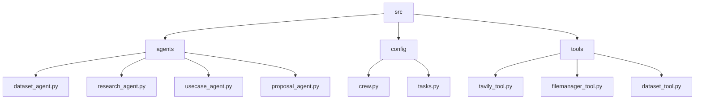
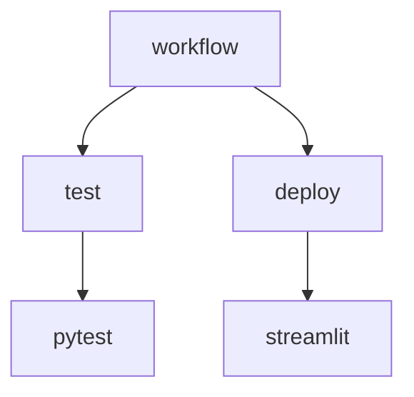

# Research Agent 🤖

## 🗂️ Description

The Research Agent is a Streamlit-based web application designed to automate industry and company research, generating AI use cases and curated datasets. This project leverages the CrewAI framework, LangChain, and other cutting-edge libraries to provide a robust and user-friendly interface for research and analysis.

The Research Agent is ideal for researchers, analysts, and businesses seeking to streamline their research processes and gain valuable insights. With its intuitive UI and powerful backend, this application enables users to input a company name, generate AI use cases, and explore related datasets.

## ✨ Key Features

### Research Capabilities

* Conduct industry and company research using the Tavily Search Tool
* Generate AI use cases based on research findings
* Curate datasets for specific use cases

### Agent-based Architecture

* Research Agent: conducts industry and company research
* Use Case Agent: generates AI use cases
* Dataset Agent: curates datasets for specific use cases
* Proposal Agent: synthesizes findings into a structured markdown report

### Tech Integration

* CrewAI framework for agent-based architecture
* LangChain for language model interactions
* Streamlit for web application UI
* Tavily Search Tool for research capabilities

## 🗂️ Folder Structure

## 🛠️ Tech Stack

## ⚙️ Setup Instructions

To run the Research Agent locally, follow these steps:

* Clone the repository: `git clone https://github.com/Srilochan7/research-agent.git`
* Install dependencies: `pip install -r requirements.txt`
* Set environment variables:
	+ Create a `.env` file in the root directory
	+ Add `TAVILY_API_KEY=your_api_key` to the `.env` file
* Run the application: `python run.py`

## 🤖 GitHub Actions

This repository uses GitHub Actions to automate testing and deployment. The workflow is defined in `.github/workflows/main.yml` and includes jobs for:

* Testing: runs unit tests and integration tests
* Deployment: deploys the application to a production environment

  

<h3>lochan</h3>

Building whatever.

 

  <a href="https://gitfull.vercel.app">Made by GitFull</a>

    